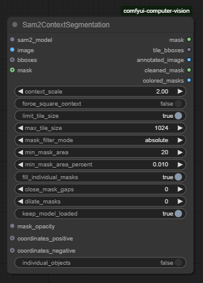
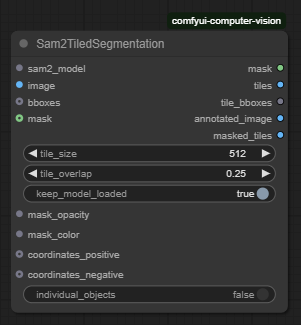

# ComfyUI-Computer-Vision

Extension nodes for [ComfyUI](https://github.com/comfyanonymous/ComfyUI) that improves automatic segmentation using bounding boxes generated by Florence 2 and segmentation from Segment Anything 2 (SAM2).

**Problem to solve:**  
While SAM2 generally provides good segmentations, its large models often struggle with small objects — even when accurate bounding boxes are provided — leading to coarse or missed masks. Conversely, small models tend to perform better on fine details and small objects but fail when multiple or large objects are present.

**The approach:**  
This extension uses the large SAM2 model but improves its precision by cropping the input image around each bounding box, effectively creating a context-aware view that focuses the segmentation on the target object. This balances the high capacity of the large model with the accuracy typically seen in the small variant, while preserving performance on larger or complex scenes.

It integrates and extends the capabilities of:
- [kijai/ComfyUI-segment-anything-2](https://github.com/kijai/ComfyUI-segment-anything-2)
- [Florence 2](https://www.microsoft.com/en-us/research/publication/florence-2-advancing-a-unified-representation-for-a-variety-of-vision-tasks/)
- [Segment Anything 2 (SAM2)](https://segment-anything.com/)

Also used for the alternative node:
- [SAHI: Slicing Aided Hyper Inference](https://github.com/obss/sahi)

---

## Test Results

| Prompt        | Original image   | Florence bboxes  | Context node     | Tiled node       | Large SAM2.1     | Small SAM2.1     |
|---------------|------------------|------------------|------------------|------------------|------------------|------------------|
| golf ball     | ![][gb_orig]     | ![][gb_flor]     | ![][gb_ctx]      | ![][gb_tiled]    | ![][gb_large]    | ![][gb_small]    |
| golf club     | ![][gc_orig]     | ![][gc_flor]     | ![][gc_ctx]      | ![][gc_tiled]    | ![][gc_large]    | ![][gc_small]    |
| human face    | ![][hf_orig]     | ![][hf_flor]     | ![][hf_ctx]      | ![][hf_tiled]    | ![][hf_large]    | ![][hf_small]    |
| shoes, hands, cap, mouth, pants, ball, Nike logo, watch  | ![][mix_orig]    | ![][mix_flor]    | ![][mix_ctx]     | ![][mix_tiled]   | ![][mix_large]   | ![][mix_small]   |

* Context and Tiled nodes used SAM2.1 Large model for segmentation
* Node settings are identical across all tests

<!-- Image aliases -->

[gb_orig]: test_images/comparisons/1_original%20image.jpg  
[gb_flor]: test_images/comparisons/1_golf%20ball_florence.jpg  
[gb_ctx]: test_images/comparisons/1_golf%20ball_context.jpg  
[gb_tiled]: test_images/comparisons/1_golf%20ball_tiled.jpg  
[gb_large]: test_images/comparisons/1_golf%20ball_large.jpg  
[gb_small]: test_images/comparisons/1_golf%20ball_small.jpg  

[gc_orig]: test_images/comparisons/1_original%20image.jpg  
[gc_flor]: test_images/comparisons/1_golf%20club_florence.jpg  
[gc_ctx]: test_images/comparisons/1_golf%20club_context.jpg  
[gc_tiled]: test_images/comparisons/1_golf%20club_tiled.jpg  
[gc_large]: test_images/comparisons/1_golf%20club_large.jpg  
[gc_small]: test_images/comparisons/1_golf%20club_small.jpg  

[hf_orig]: test_images/comparisons/1_original%20image.jpg  
[hf_flor]: test_images/comparisons/1_human%20face_florence.jpg  
[hf_ctx]: test_images/comparisons/1_human%20face_context.jpg  
[hf_tiled]: test_images/comparisons/1_human%20face_tiled.jpg  
[hf_large]: test_images/comparisons/1_human%20face_large.jpg  
[hf_small]: test_images/comparisons/1_human%20face_small.jpg  

[mix_orig]: test_images/comparisons/2_original%20image.jpg  
[mix_flor]: test_images/comparisons/2_shoes,%20hands,%20cap,%20mouth,%20pants,%20ball,%20Nike%20logo,%20watch_florence.jpg  
[mix_ctx]: test_images/comparisons/2_shoes,%20hands,%20cap,%20mouth,%20pants,%20ball,%20Nike%20logo,%20watch_context.jpg  
[mix_tiled]: test_images/comparisons/2_shoes,%20hands,%20cap,%20mouth,%20pants,%20ball,%20Nike%20logo,%20watch_tiled.jpg  
[mix_large]: test_images/comparisons/2_shoes,%20hands,%20cap,%20mouth,%20pants,%20ball,%20Nike%20logo,%20watch_large.jpg  
[mix_small]: test_images/comparisons/2_shoes,%20hands,%20cap,%20mouth,%20pants,%20ball,%20Nike%20logo,%20watch_small.jpg  

---

## Available Nodes

| Node                     | Type              | Description                                                                                       | Image                                                                 |
|--------------------------|-------------------|---------------------------------------------------------------------------------------------------|------------------------------------------------------------------------|
| `Sam2ContextSegmentation` | ✅ Main Node       | Segments objects from bounding boxes by generating crops centered on each box. Uses local context to guide SAM2 toward cleaner and more coherent results. |  |
| `Sam2TiledSegmentation`   | ⚠️ Alternative     | Segmentation via regular tiling using [SAHI](https://github.com/obss/sahi). Works in simple cases but is less accurate than the contextual approach. |      |

---

## Context Process

| Output                    | Description                                                                                          | Image                  |
|---------------------------|------------------------------------------------------------------------------------------------------|------------------------|
| Original Image            | Input image containing one or more objects to be segmented                                           | ![][orig_img]          |
| Florence Bounding Boxes   | Image annotated with bounding boxes predicted by Florence 2 for each detected object (ball, glove)   | ![][florence_bboxes]   |
| Context Tiles             | Contextual crops centered on each bounding box, used as input for SAM2                               | ![][context_tiles]     |
| Colored Masks             | Per-object segmentation masks overlaid with unique colors for visual clarity                         | ![][colored_masks]     |
| Cleaned Mask              | Composite mask with small, disconnected regions removed to reduce noise (if setting is enabled)      | ![][cleaned_mask]      |
| Final Mask                | Final mask combining all cleaned segments, used for downstream processing                            | ![][final_mask]        |

<!-- Image aliases -->

[orig_img]: test_images/context_process/original%20image.jpg  
[florence_bboxes]: test_images/context_process/florence%20bounding%20boxes.jpg  
[context_tiles]: test_images/context_process/context%20tiles.jpg  
[colored_masks]: test_images/context_process/colored%20masks.jpg  
[cleaned_mask]: test_images/context_process/cleaned%20mask.jpg  
[final_mask]: test_images/context_process/final%20mask.jpg  

---

## Installation

You can install this extension in two ways:

- **Via ComfyUI Manager**: Search for `ComfyUI-Computer-Vision` and install directly.
- **Manual Clone**: Clone or download this repository into your `ComfyUI/custom_nodes/` folder.

After restarting ComfyUI, the nodes `Sam2ContextSegmentation` and `Sam2TiledSegmentation` will appear and be ready to use.

A complete example workflow is included in the `workflows` folder to demonstrate how to use the context-based segmentation effectively.

---

## Roadmap

✔️ **Completed**
- Contextual segmentation with automatic crops centered on the bounding box
- Mask cleanup (merging, noise removal)

🚧 **In development**
- Integration of Florence2 node with contextual logic
- Creation of mask management nodes

🧭 **Under evaluation**
- Merge with original `ComfyUI-segment-anything-2` nodes
- Run Florence models locally (ONNX)
- Text-prompt guided segmentation

---

## Credits

Thanks to the following open-source projects for their valuable contributions:

- [Florence 2](https://www.microsoft.com/en-us/research/publication/florence-2-advancing-a-unified-representation-for-a-variety-of-vision-tasks/)
- [Segment Anything 2](https://github.com/facebookresearch/segment-anything)
- [SAHI](https://github.com/obss/sahi)
- [ComfyUI Segment Anything 2 (Kijai)](https://github.com/kijai/ComfyUI-segment-anything-2)
